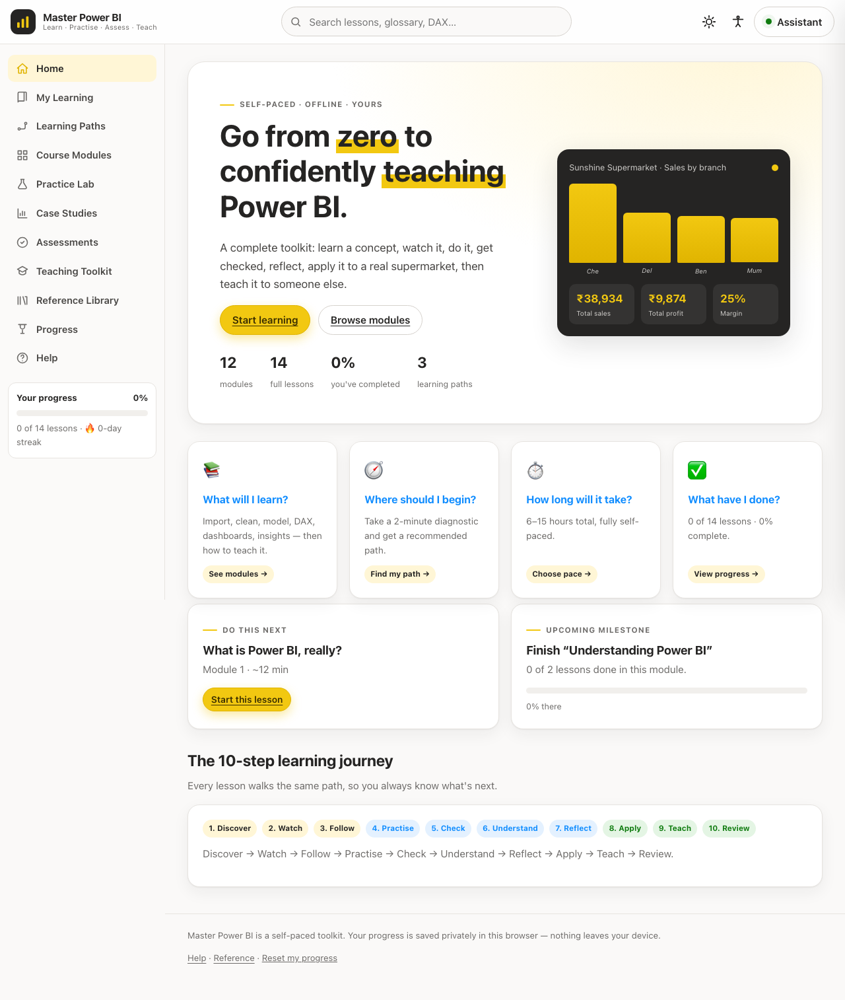
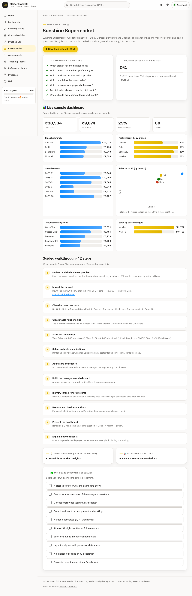

# Master Power BI — Learn · Practise · Assess · Teach

A complete, self-contained toolkit that takes a learner from **zero Power BI knowledge** to
confidently **building and teaching** professional dashboards — without a live trainer.

Built for faculty members and future trainers, but friendly to any beginner. It runs entirely
in the browser: **no backend, no build step, no internet required** after loading. Progress is
saved privately in `localStorage` and never leaves the device.



## Run it

```bash
# Just open the file — that's it.
open index.html            # macOS
# or double-click index.html in any file manager
```

Prefer a local server (recommended, so downloads and routing behave exactly as intended):

```bash
python3 -m http.server 8000
# then visit http://localhost:8000
```

No dependencies to install.

## What's inside

- **12 modules / 14 lessons**, each following the same **10-step journey** so learners always
  know where they are:
  *Discover → Watch → Follow → Practise → Check → Understand → Reflect → Apply → Teach → Review.*
  Every lesson has outcomes, an everyday analogy, an "explain it another way" switch, a
  controllable demo player (play/pause/step/captions/transcript), a 3-level hint ladder,
  immediate feedback, common mistakes, a knowledge check, a teach-back task, and a recommended
  next lesson.
- **3 learning paths** (Beginner · Intermediate · Faculty Mastery) plus a scored **diagnostic**
  that recommends where to start.
- **Sunshine Supermarket case study** — a downloadable 60-row CSV and a **live dashboard computed
  from the data** (sales by branch, margin, monthly trend, SVG scatter). The data is tuned so the
  "high sales ≠ high profit" lesson genuinely emerges (Chennai: top sales, worst margin; Delhi:
  best margin). Plus three mini projects (school attendance, hospital service, household budget).
- **Practice Lab** — matching, DAX-completion, debugging, ordering and scenario exercises.
- **Assessments** — per-module quizzes with mastery bands (Review / Developing / Proficient /
  Mastered). Retake anything; progress is never blocked.
- **Teaching Toolkit** — lesson plans, demo scripts, student exercises, common student questions,
  rubrics and printable worksheets.
- **Reference Library** — searchable glossary, DAX reference, keyboard shortcuts, flashcards, FAQ.
- **Progress** — badges, a faculty-readiness score, a personalised improvement plan, and a
  printable completion certificate.
- **Learning Assistant** — a persistent, context-aware helper that gives hints and analogies
  **without doing the activity for you**.



## Accessibility & design

- Light and dark themes, adjustable text size, and a reduced-motion option.
- Full keyboard navigation, visible focus, ARIA labels; meaning is never conveyed by colour alone.
- Responsive from mobile to desktop.
- Power BI-inspired visual identity (yellow `#F2C811`, charcoal, soft neutrals) on a Segoe UI-led
  system font stack — on-brand *and* fully offline.

## Project structure

```
index.html            # app shell (nav, assistant, modals)
assets/
  styles.css          # design system + responsive + light/dark
  content.js          # all curriculum, glossary, DAX, dataset, toolkit  (window.PBI)
  store.js            # private localStorage progress store               (window.Store)
  assistant.js        # rule-based Learning Assistant                     (window.Assistant)
  app.js              # hash router, views, and interactive components
docs/                 # screenshots
```

All example data is fictional and anonymous.

## Data & privacy

Everything you do is stored locally in your browser. Nothing is uploaded. Use **Reset my
progress** in the footer to clear it at any time.

---

Self-paced learning toolkit · issued and stored locally on the learner's device.
